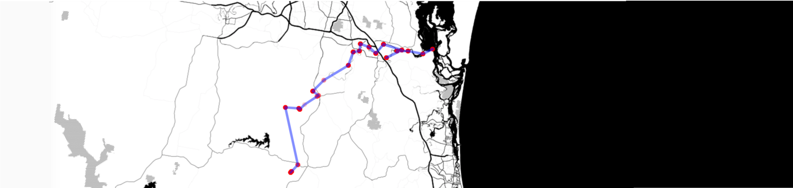
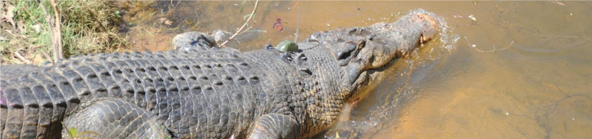
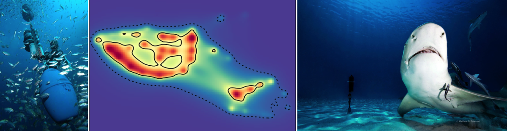

# VTrack

[](http://www.repostatus.org/#active)
[](https://cran.r-project.org/package=VTrack)
[](http://www.r-pkg.org/pkg/VTrack)
[](http://r-pkg.org/pkg/VTrack)

<br>

A package housing a collection of R Functions for the Analysis of Passive Acoustic Telemetry Data Collected by VEMCO Acoustic Tracking Equipment

The 'VTrack' package was built to facilitate the assimilation, analysis and synthesis of animal location data collected by the VEMCO suite of acoustic transmitters and receivers. As well as database and visualisation capabilities, 'VTrack' also provides functions to identify ecologically relevant events from tag detection and sensor data (e.g. residence, movements, diving, surfacing events). This procedure condenses the acoustic detection database by orders of magnitude, greatly enhancing the synthesis of acoustic detection data.

<br>


# Installation and usage

The `VTrack` package can be found on [CRAN](https://cran.r-project.org/web/packages/VTrack/index.html)

The package can be installed directly from R:
```ruby
install.packages("VTrack")
```

The development version of the package can is also available via this Github page:
```ruby
install.packages("devtools")
devtools::install_github("rossdwyer/VTrack")
```

A brief overview of VTrack functions and its use can be found [here](https://www.uq.edu.au/eco-lab/animal-tracking-workshop-notes).

<br>


# New Features

VTrack version >2.0.0 now hosts the Animal Tracking Toolbox (ATT). The ATT calculates standardised metrics of dispersal and activity space to enable direct comparisons between animals tracked within the same study and between studies or locations. The functions use tag detection data alongside tag metadata and receiver station information to calculate standardised movement and activity space metrics. 

A brief user guide and walk through for the new ATT operations can be found [here](http://vinayudyawer.github.io/ATT/docs/ATT_Vignette.html).


<br>
<br>

# Citation

To cite the `VTrack` package in publications use:

**Campbell HA, Watts ME, Dwyer RG, Franklin CE (2012) V-Track: software for analysing and visualising animal movement from acoustic telemetry detections, Marine and Freshwater Research 63(9):815-820. doi: [10.1071/MF12194](http://www.dx.doi.org/10.1071/MF12194)**

To cite the Animal Tracking Toolbox operations within the `VTrack` package use:

**Udyawer V, Dwyer RG, Hoenner X, Babcock RC, Brodie S, Campbell HA, Harcourt RG, Huveneers C, Jaine FRA, Simpfendorfer CA, Taylor MD, Heupel MR (2018) A standardised framework for analysing animal detections from automated tracking arrays. Animal Biotelemetry 6(1):17. doi: [10.1186/s40317-018-0162-2](http://www.dx.doi.org/10.1186/s40317-018-0162-2)**


